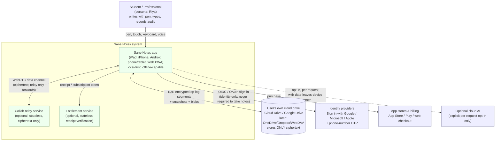
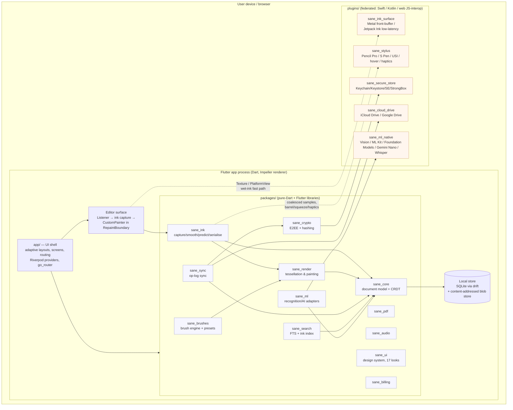
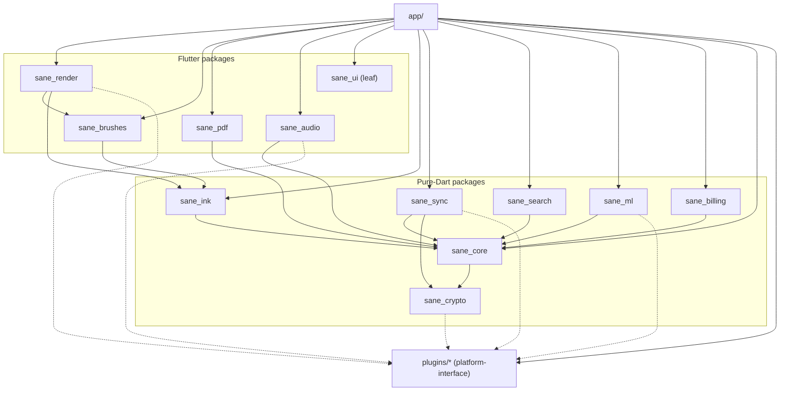

# Sane Notes — Architecture Overview

> Audience: an autonomous coding agent (or engineer) with **zero prior context** who must
> extend this codebase without breaking its guarantees. Read this before touching code.
> This document is the map; the ADRs in [`docs/adr/`](../adr/) are the individual decisions
> with their rationale, alternatives and verification steps.
>
> Status: **living document**, v1 (M0 Foundations). Update it in the same PR whenever you
> change a package boundary, a data flow, a build flavour, or the threading model.

Sane Notes is a **pen-first, privacy-first, local-first** note-taking app for iPadOS, iOS,
Android phone/tablet and the Web (PWA). The three architectural pillars, in priority order,
are:

1. **UX first, then security first.** The wet-ink latency budgets in
   [locked decision 7](#appendix-a--locked-decisions-this-doc-must-honour) are hard gates,
   not aspirations. Nothing that misses them ships.
2. **Zero-knowledge, local-first.** Note content lives on the device. No Sane Notes server
   ever stores note content. Optional sync uses the **user's own** cloud, end-to-end
   encrypted with keys we never hold. See [ADR-0004](../adr/0004-local-first-zero-server.md),
   [ADR-0007](../adr/0007-end-to-end-encryption-and-keys.md) and
   [`docs/security/threat-model.md`](../security/threat-model.md).
3. **One codebase, five surfaces, in lock-step.** Flutter + Dart 3, with a thin native
   plugin layer for the things Flutter cannot do well (low-latency ink, stylus extras,
   secure storage, on-device ML, cloud-drive access). See
   [ADR-0001](../adr/0001-flutter-single-codebase.md) and
   [ADR-0012](../adr/0012-native-plugin-strategy.md).

Everything below MUST agree with the locked decisions. Where research contradicts a locked
decision, we keep the decision and record the risk (the Goodnotes/Flutter and web-ink cases
are called out inline).

---

## 1. C4-style system views

We describe the system in two C4 levels: **Context** (Sane Notes and the external systems it
touches) and **Container** (the deployable/runnable pieces and the major code modules inside
the app). Component-level detail lives in each package's own README and in the ADRs.

### 1.1 Level 1 — System context



**Key context facts an agent must internalise:**

- The **app is the system of record.** The relay and entitlement services are *optional,
  minimal, stateless* and **never see plaintext note content**. If both services are down,
  the app still fully works for a single user with local storage.
- **Sync flows to the user's own cloud**, not ours. We put E2E-encrypted bytes into the
  user's iCloud Drive / Google Drive. We cannot read them. See
  [`sane_sync`](#4-monorepo-layout) and [`sane_crypto`](#4-monorepo-layout).
- **Identity is optional.** Guest mode is first-class (locked decision 5). Sign-in only
  unlocks profile, sharing/collab and entitlements.
- **AI is on-device by default** (locked decision 6). The dotted line to cloud AI is an
  explicit, per-request opt-in with a visible "data leaves device" indicator.

### 1.2 Level 2 — Container view (inside the app)



**Container-level rules of thumb:**

- The **`app/`** container is the *composition root*: it wires Riverpod providers to the
  logic packages, chooses adaptive layouts, and owns routing. It contains almost no business
  logic — that lives in `packages/`.
- **`packages/`** are reusable libraries. They never import `app/` and never import each
  other except along the allowed dependency DAG (§5).
- **`plugins/`** are leaf native bridges. They expose a Dart API and never depend on
  `packages/` or `app/`. Packages/app depend on the plugin's *platform-interface*.
- The **local store** (drift/SQLite + blob store) is reached only through `sane_core`'s
  repository interfaces — no other package writes SQL directly.

---

## 2. The two runtime "tiers" per surface

Not every surface can hit the same fidelity. The architecture explicitly plans for two
inking tiers, chosen at runtime by capability detection:

| Tier | Surfaces | Wet-ink path | Latency target (decision 7) |
|---|---|---|---|
| **A — native fast path** | iPad (ProMotion), Android tablet/phone with low-latency stylus | Flutter `Listener` model updates **plus** native front-buffer surface (`sane_ink_surface`) composited via `Texture` | ≤ 16 ms iPad, ≤ 25 ms mid Android |
| **B — pure-Flutter path** | Web (all browsers), any device where Tier A is unavailable, low-end fallback | `Listener` → `sane_ink` → `CustomPainter` in `RepaintBoundary`, Impeller (mobile/desktop) or CanvasKit/skwasm (web) | ≤ 30 ms web (Chrome desktop); best-effort elsewhere |

Tier selection is a **capability query**, not a platform check: `sane_ink_surface` reports
whether a native low-latency surface is available on this device/OS build; if not, the editor
falls back to Tier B transparently. The **risk gate** in
[ADR-0001](../adr/0001-flutter-single-codebase.md) (the `SN-INK` latency spike in M0)
measures both tiers on three reference devices; if Tier B cannot meet budget on a target
surface and Tier A is unavailable there, that surface's editor pivots to native views with
the Dart core retained. This is the documented exit criterion.

> **Web reality check (`research/web-stylus-and-pwa-capabilities.md`,
> `research/flutter-ink-stack.md`):** Flutter Web has **no Impeller**; it renders through
> CanvasKit (default) or skwasm (needs COOP/COEP cross-origin isolation). **skwasm/WASM-GC
> cannot run in any iOS browser** (WebKit lacks WasmGC), so iPad-Safari users of the web
> build get the JS/CanvasKit path automatically. The web target is therefore "view +
> light-edit first," and the Ink API / `desynchronized` canvas / coalesced-event tricks
> from the research are **not directly reachable through Flutter's canvas** — they are noted
> as future levers in [ADR-0010](../adr/0010-web-pwa-strategy.md).

---

## 3. Data flow: a pen stroke from OS event to pixels to persistence to sync

This is the single most important flow in the app. Follow it end to end.

```mermaid
sequenceDiagram
    autonumber
    participant OS as OS input<br/>(UITouch/Pencil, MotionEvent, PointerEvent)
    participant Eng as Flutter engine<br/>(PointerData)
    participant L as Listener (app/editor)
    participant Ink as sane_ink<br/>(capture/smooth/predict)
    participant Nat as sane_ink_surface<br/>(native front-buffer)
    participant Paint as sane_render<br/>(CustomPainter)
    participant Core as sane_core<br/>(CRDT doc model)
    participant DB as Storage isolate<br/>(drift + blob store)
    participant Idx as Search isolate<br/>(sane_search)
    participant Sync as Sync isolate<br/>(sane_sync + sane_crypto)
    participant Cloud as User cloud drive

    OS->>Eng: raw pen samples (pressure, tilt, azimuth, ts)
    Eng->>L: PointerDownEvent / PointerMoveEvent (logical px)
    Note over L,Ink: pen vs finger/palm disambiguated by event.kind == stylus
    L->>Ink: append sample to active stroke
    Ink->>Ink: smoothing + streamline + pressure model + prediction
    par Wet-ink render (Tier A)
        Ink-->>Nat: mirror samples to native surface (Texture)
        Nat-->>OS: front-buffer draw ahead of next Flutter frame
    and Wet-ink render (Tier B / always)
        Ink->>Paint: active-stroke outline (perfect_freehand)
        Paint->>Eng: repaint ONLY the RepaintBoundary layer
    end
    OS->>Eng: PointerUpEvent
    Eng->>L: stroke finished
    L->>Ink: finalise stroke
    Ink->>Ink: serialise to compressed point deltas
    Ink->>Core: commit Stroke object (CRDT op: add-wins id + LWW props + HLC)
    Core->>Paint: flatten finished stroke into cached Picture/tile
    Core->>DB: append op to op-log; upsert object; write stroke bytes as content-addressed blob
    DB-->>Core: ack (persisted)
    Core->>Idx: notify (index ink geometry / recognised text later)
    opt Sync enabled (user opted into a cloud)
        Core->>Sync: op-log segment ready
        Sync->>Sync: batch + envelope-encrypt (per-notebook key, XChaCha20/AES-GCM)
        Sync->>Cloud: write ciphertext segment/snapshot/blob
        Cloud-->>Sync: remote segments from other devices
        Sync->>Sync: decrypt + CRDT-merge
        Sync->>Core: apply merged ops
        Core->>Paint: repaint affected region
    end
```

**Step notes (why each stage exists):**

1. **Raw capture.** The editor wraps its canvas in a raw `Listener`
   (`research/flutter-ink-stack.md`), *not* a `GestureDetector`, so we get every
   pressure/tilt/azimuth sample without a gesture recognizer delaying or "winning" the
   pointer. Pan/zoom is handled by a coexisting `RawGestureDetector`/`InteractiveViewer`,
   disambiguated by `event.kind == PointerDeviceKind.stylus` (palm rejection).
2. **Smoothing/prediction.** `sane_ink` wraps `perfect_freehand`'s `getStroke` for the
   pressure outline and applies streamlining + optional forward prediction. Do **not** enable
   `GestureBinding.resamplingEnabled` on the draw path — it trades latency for smoothing and
   we want fidelity (`research/flutter-ink-stack.md`).
3. **Two render paths, same samples.** Tier A mirrors samples to the native front-buffer for
   the *wet* stroke only; Tier B paints the active stroke in a `CustomPainter` isolated by a
   `RepaintBoundary` so ink repaints never invalidate the rest of the UI. Finished strokes
   are flattened into a cached `Picture`/tiled raster so only the active stroke repaints each
   frame.
4. **Commit as a CRDT op.** On pointer-up the stroke becomes a `Stroke` object in the
   document model: an **add-wins** object id, **LWW registers** for props, an **HLC** stamp
   (locked decision 4). The op is appended to the per-device **append-only op-log**.
5. **Persist.** The storage isolate writes the op + object row to SQLite (drift) and stores
   the serialized stroke bytes (and any image/PDF/audio) as **content-addressed encrypted
   blobs**. Snapshots are written periodically (debounced), not per stroke.
6. **Index.** `sane_search` updates its FTS + ink index off the UI isolate; recognised text
   (from `sane_ml`) is indexed when available.
7. **Sync (optional).** If the user enabled a cloud, `sane_sync` batches op-log segments,
   `sane_crypto` envelope-encrypts them (per-notebook key wrapped by the user master key in
   Keychain/Keystore), and writes **ciphertext** to the user's drive. Remote segments are
   pulled, decrypted, CRDT-merged and applied. The cloud only ever holds ciphertext.

**Invariant:** the UI isolate must never block on steps 5–7. Persistence, indexing and sync
are asynchronous and isolate-offloaded. A dropped network or a slow disk must not add a
single millisecond to wet-ink latency.

---

## 4. Monorepo layout

One Git repo (`swiftsaneai/sanenotes`), managed as a Dart/Flutter workspace (see
[ADR-0002](../adr/0002-monorepo-layout.md)). One-line purpose per folder:

```text
sanenotes/
├── app/                      Flutter app — ONE codebase, adaptive layouts for all 5 surfaces; composition root
├── packages/                 Reusable libraries (pure Dart unless noted); no UI shell logic here
│   ├── sane_core/            Document model (Workspace→Profile→Notebook→Page→Layer→Object) + CRDT + Result/Failure + repository interfaces  [pure Dart]
│   ├── sane_ink/             Stroke capture, smoothing, streamline, prediction, geometry, delta serialisation  [pure Dart]
│   ├── sane_render/          Tessellation & painting of strokes/objects into dart:ui Canvas; tile/Picture caching  [Flutter]
│   ├── sane_brushes/         Brush engine (nibs, dynamics, textures) + presets/brush studio model  [Flutter]
│   ├── sane_sync/            Append-only op-log sync over user cloud drives; CRDT merge orchestration; conflict handling  [pure Dart]
│   ├── sane_crypto/          E2EE (XChaCha20-Poly1305 / AES-256-GCM envelope), key wrapping, content-address hashing, recovery codes  [pure Dart]
│   ├── sane_pdf/             PDF import/render/annotate/export (pdfrx/PDFium; export via printing/syncfusion)  [Flutter]
│   ├── sane_audio/           Recording, playback, audio↔ink/text timestamp anchors, waveform  [Flutter]
│   ├── sane_search/          Full-text search (FTS5) + handwriting/ink index + query model  [pure Dart]
│   ├── sane_ml/              Recognition/AI adapters (handwriting, OCR, math, summaries, Q&A, flashcards); on-device-first  [pure Dart interfaces]
│   ├── sane_ui/              Design system: tokens, 17 looks (light/dark), components, typography, iconography  [Flutter, leaf]
│   └── sane_billing/         Plans, entitlements, IAP/web-checkout adapters, student-verification model  [pure Dart]
├── plugins/                  Federated Flutter plugins: Dart platform-interface + Swift(iOS/iPadOS)/Kotlin(Android)/web(JS-interop) impls
│   ├── sane_ink_surface/     Native low-latency wet-ink surface: Metal/CAMetalLayer front-buffer (Apple), Jetpack Ink + androidx.graphics.lowlatency (Android)
│   ├── sane_stylus/          Stylus extras: Apple Pencil Pro squeeze/barrel-roll/hover/haptics, S Pen, USI; coalesced-sample capture
│   ├── sane_scribble/        OS handwriting-entry hooks (Apple Scribble); NOTE: Scribble is not scriptable, DOM/text-field only on web
│   ├── sane_secure_store/    Keychain / Keystore / Secure Enclave / StrongBox key storage; biometric gate
│   ├── sane_cloud_drive/     iCloud Drive (ubiquity container / NSFileCoordinator), Google Drive (appDataFolder + visible export folder)
│   ├── sane_ml_native/       Vision / Speech / Foundation Models (Apple); ML Kit / Gemini Nano (Android); Whisper (web/wasm)
│   └── sane_pdfkit/          Native PDF render acceleration where beneficial (PDFKit on Apple); otherwise pdfium via sane_pdf
├── services/                 OPTIONAL, minimal, stateless. NEVER stores note content
│   ├── entitlements/         Receipt/subscription verification → signed entitlement token
│   └── relay/                E2E collaboration relay that only ever forwards ciphertext (WebRTC signalling + fallback)
├── website/                  Marketing + docs + "try on web" (the PWA build target lives in app/ web output)
├── tools/                    Scripts, perf harness, device-lab configs
│   ├── perf_harness/         Pen-to-pixel latency + fps + memory measurement (CI perf gates, decision 7)
│   ├── device_lab/           Reference-device configs (iPad ProMotion, mid Android, low-end 4 GB Android)
│   └── scripts/              Dev/CI helper scripts (issue publishing, codegen runners, arch-lint)
├── docs/                     Architecture (this file), ADRs, design, security, platform, research sources
│   ├── architecture/         overview.md (this), diagrams
│   ├── adr/                  Architecture Decision Records (0001…)
│   ├── design/              design-system.md, tokens.json, screens-and-flows.md
│   ├── security/            threat-model.md (STRIDE + LINDDUN), controls-matrix, devsecops-pipeline, secure-coding-checklist, ssdlc-process
│   ├── platform/           per-surface capability notes (ipad, android, web, phones, compatibility-matrix, performance-budgets)
│   └── research/sources/    committed copies of the research inventories cited as research/*.md
├── design/                   Design source of truth: Sane Notes.dc.html, Sane Notes Design Sheet.dc.html, assets
└── issues/                   Machine-readable backlog (labels.json, milestones.json, SCHEMA.md, SN-*.json)
```

`[pure Dart]` packages MUST NOT import `package:flutter`; `[Flutter]` packages may. This
keeps the model/logic testable without a widget harness and portable to a future Rust core.

---

## 5. Package dependency rules (what may import what)

Dependencies form a **strict DAG**. A cycle is a build error and a review blocker. The
allowed edges:



**The rules, stated normatively:**

1. **`app/` may import any package or plugin.** Nothing may import `app/`.
2. **`sane_core` is the root of the model DAG.** It may import only `sane_crypto` (for
   content-address hashing and key types). It MUST NOT import any other package.
3. **`sane_crypto` imports nothing internal.** It is the lowest layer.
4. **The ink stack layers upward:** `sane_ink → sane_core`; `sane_brushes → sane_ink`;
   `sane_render → sane_brushes, sane_ink, sane_core`. No downward or sideways edges.
5. **Feature/logic packages** (`sane_pdf`, `sane_audio`, `sane_search`, `sane_ml`,
   `sane_billing`, `sane_sync`) depend on `sane_core` (and `sane_sync` also on
   `sane_crypto`). They MUST NOT depend on each other. Cross-feature coordination happens in
   `app/` via providers, never by package-to-package imports.
6. **`sane_ui` is a pure leaf.** It depends on nothing internal (Flutter + tokens only). It
   MUST NOT import model or feature packages. Feature widgets that need both UI and logic are
   composed in `app/`, not inside `sane_ui`.
7. **`plugins/*` are leaves.** They MUST NOT import `packages/` or `app/`. Packages that need
   a native capability depend on the plugin's *platform-interface* package only
   ([ADR-0012](../adr/0012-native-plugin-strategy.md)).
8. **No package writes SQL or touches the file system directly** except through `sane_core`'s
   repository/store interfaces (implemented against drift/blob store). This keeps persistence
   swappable and testable.

Enforcement: a CI arch-lint (`tools/scripts/arch_check`) parses each `pubspec.yaml` and
fails the build if a dependency edge is not in the allowed set, plus a `package:flutter` ban
on pure-Dart packages. See [ADR-0002](../adr/0002-monorepo-layout.md#how-to-verify).

---

## 6. Threading & isolate model

Dart is single-threaded per isolate; concurrency is **isolates + async**. The rule is simple:
**the UI (root) isolate does input and paint; everything heavy is elsewhere.**

| Isolate / worker | Owns | Never does |
|---|---|---|
| **UI / root isolate** | Gesture handling, `sane_ink` active-stroke capture+smoothing, `CustomPainter` active-stroke paint, widget build/layout, Riverpod state | Blocking I/O, SQL, encryption, network, PDF raster, ML |
| **Storage isolate** | drift/SQLite reads+writes, op-log append, blob store I/O, snapshotting | UI, network |
| **Sync isolate** | op-log batching, `sane_crypto` encrypt/decrypt, cloud-drive I/O, CRDT merge of remote segments | UI, painting |
| **Search/index isolate** | FTS5 indexing, ink-index building, query execution | UI |
| **One-shot compute** (`Isolate.run`/`compute`) | Finished-stroke tessellation, image/PDF page decode, export (PDF/PNG/SVG), thumbnail generation | long-lived state |
| **Native threads** (via plugins) | Front-buffer ink render, ML Kit / Vision / Foundation Models inference, secure-enclave ops, cloud SDK calls | — |

**Concrete guidance:**

- Use `Isolate.run(...)` (Dart 3) or Flutter's `compute(...)` for *stateless one-shot* heavy
  work. Use a **long-lived isolate** (spawned once, message-passed) for the storage, sync and
  index workers so you don't pay spawn cost per operation. drift natively supports running its
  database in a background isolate — use that (`research/flutter-ink-stack.md`).
- **Only send serialisable messages** across isolates: transfer strokes as their compressed
  byte form, not live objects with closures. `sane_core` value objects are immutable and
  cheap to copy.
- **Tessellation of finished strokes** can move to a one-shot isolate under load, but the
  *active* wet stroke is always painted on the UI isolate (it must track the pen with no
  hand-off latency).
- **Web mapping:** Dart isolates compile to **Web Workers**. `OffscreenCanvas`-style
  off-thread rendering and multithreaded WASM (skwasm, whisper.cpp) require **cross-origin
  isolation** (`COOP: same-origin` + `COEP: require-corp`) — a hard deployment constraint
  (`research/web-stylus-and-pwa-capabilities.md`, [ADR-0010](../adr/0010-web-pwa-strategy.md)).
  Some plugin operations are main-thread-only on web; feature-detect and degrade.
- **Never** hop to another isolate on the hot draw path. Cross-isolate messaging has latency;
  it belongs on commit/persist/sync, not on `PointerMoveEvent`.

---

## 7. Build flavours & the `--dart-define` matrix

Three flavours, selected by `--dart-define=SANE_FLAVOR=…` plus Flutter's build mode
(`--debug`/`--profile`/`--release`). See [ADR-0011](../adr/0011-telemetry-and-diagnostics.md)
for the telemetry defaults per flavour.

| Flavour | Build mode | Auth bypass | Obfuscation | Logging | Telemetry | Backends |
|---|---|---|---|---|---|---|
| **dev** | debug/profile | **allowed** via `SANE_AUTH_BYPASS=true` | off | verbose (trace), asserts on | off | mock / local emulators |
| **beta** | profile/release | **impossible** | on (`--obfuscate --split-debug-info`) | info + opt-in sanitized crash | opt-in (default off), staged | staging entitlement/relay |
| **release** | release | **impossible** | on | warn/error only, opt-in crash | opt-in only | production entitlement/relay |

### 7.1 `--dart-define` matrix

Read all runtime config from `--dart-define`; **never hardcode a secret in Dart** (locked
decision, and Dart AOT is reversible — `research/flutter-ink-stack.md`). Production client
IDs/secrets come from CI secrets later.

| Key | Type | dev default | beta | release | Meaning |
|---|---|---|---|---|---|
| `SANE_FLAVOR` | enum | `dev` | `beta` | `release` | Selects flavour config bundle |
| `SANE_AUTH_BYPASS` | bool | `false`* | `false` (rejected) | `false` (rejected) | Skips real sign-in; **guarded to be inert in release** (§7.2) |
| `SANE_ENV` | enum | `local` | `staging` | `prod` | Which backend environment |
| `SANE_ENTITLEMENTS_URL` | url | mock | staging URL | prod URL | Entitlement service base |
| `SANE_RELAY_URL` | url | mock | staging URL | prod URL | Collab relay/signalling base |
| `SANE_LOG_LEVEL` | enum | `trace` | `info` | `warn` | Minimum log level (§8) |
| `SANE_TELEMETRY_DEFAULT` | bool | `false` | `false` | `false` | Telemetry is opt-in on every flavour |
| `SANE_GOOGLE_CLIENT_ID` | string | test id | staging id | prod id (CI secret) | Sign in with Google |
| `SANE_MS_CLIENT_ID` | string | test id | staging id | prod id (CI secret) | Sign in with Microsoft |
| `SANE_APPLE_SERVICES_ID` | string | test id | staging id | prod id (CI secret) | Sign in with Apple (web Services ID) |
| `SANE_AI_CLOUD_ENABLED` | bool | `false` | `false` | `false` | Master switch for optional cloud AI (still per-request opt-in) |

\* `SANE_AUTH_BYPASS=true` is only honoured in dev because of the guard below.

### 7.2 Why auth bypass is *impossible* in release (p0)

The bypass is a p0 risk (locked decision 5). It is neutralised by **three independent
layers**, so no single mistake can ship it:

1. **Compile-time dead-code elimination.** The bypass branch is written as
   `if (!kReleaseMode && _authBypass) { … }` where `_authBypass = bool.fromEnvironment('SANE_AUTH_BYPASS')`.
   Because `kReleaseMode` is a compile-time constant `false→true` flip, the Dart AOT compiler
   **tree-shakes the entire branch out of release binaries** — the code is not present to be
   triggered.
2. **Runtime guard.** App bootstrap calls `assertAuthBypassSafe()`: if `_authBypass` is true
   while `kReleaseMode` is true, it **throws on startup** (belt-and-braces for profile-mode
   confusion).
3. **CI gate.** Release CI never passes `SANE_AUTH_BYPASS=true`, and a test
   (`app/test/security/auth_bypass_test.dart`) asserts the bypass path is unreachable in a
   release-mode build. See [ADR-0003](../adr/0003-state-management-and-app-structure.md) for
   where the auth provider reads this.

---

## 8. Error handling & logging policy

### 8.1 Errors: Result for the expected, exceptions for the impossible

- **Expected/recoverable failures** (file missing, decrypt fails, network down, quota
  exceeded, parse error) are returned as a **`Result<T, Failure>`** — a sealed type in
  `sane_core` with `Ok(value)` / `Err(failure)`. Callers pattern-match (Dart 3 `switch`).
  Do **not** throw across package boundaries for these.
- **Programmer errors / broken invariants** (a null that can't be null, an unreachable
  branch, a corrupt-beyond-recovery state) use `assert`/`throw StateError` and are meant to
  crash in dev and be caught-and-reported in release. They are bugs, not conditions.
- **`Failure` is a sealed hierarchy** per domain (`StorageFailure`, `SyncFailure`,
  `CryptoFailure`, `AuthFailure`, …) carrying a stable machine code + a user-safe message key
  (localised via `sane_ui`/l10n) + optional cause. Never surface a raw exception string to
  the user.
- **Global uncaught-error capture** is installed at bootstrap: `FlutterError.onError`,
  `PlatformDispatcher.instance.onError`, and per-isolate `Isolate.current.addErrorListener`
  funnel into the sanitised crash recorder.

### 8.2 Logging: one facade, zero content

- All logging goes through a single **`SaneLog`** facade (in `sane_core`) with levels
  `trace | debug | info | warn | error`. **`print()` is banned** (lint + arch-check).
- **Never log note content, ink coordinates, decrypted data, keys, tokens, recovery codes,
  cloud file paths, email addresses, or phone numbers.** Object ids are logged as opaque
  short hashes, not raw ids. This is a privacy control, not a style preference (locked
  decision 8; GDPR/DPDP).
- **Sinks by flavour:** dev → console (pretty, trace); beta/release → an in-memory ring
  buffer the user can export as a **diagnostics bundle** (redacted) from Settings, plus an
  **opt-in** sanitised crash report. No third-party analytics SDK is linked in
  ([ADR-0011](../adr/0011-telemetry-and-diagnostics.md)).
- **Log level** is set by `SANE_LOG_LEVEL`; release defaults to `warn`. Hot-path code (draw
  loop) must not log at all in profile/release.
- **Structured fields** (event name + typed key/values) over string interpolation, so logs
  are filterable and redaction is enforceable by field allow-list.

---

## 9. Coding standards

Non-negotiable, enforced by CI. Full rationale in
[ADR-0003](../adr/0003-state-management-and-app-structure.md).

- **Lints:** `very_good_analysis` v11 as the analysis-options base (stricter than
  `flutter_lints`). CI runs `dart format --set-exit-if-changed .` and
  `dart analyze --fatal-infos`. Warnings are errors in CI.
- **Naming:** files `snake_case.dart`; types/enums `UpperCamelCase`; members/vars/params
  `lowerCamelCase`; constants `lowerCamelCase` (Dart convention, not SCREAMING_CASE); every
  package name and public prefix is `sane_…`. No abbreviations that aren't domain terms.
  Test files mirror source path with `_test.dart`.
- **Immutability by default:** prefer `final`/`const`; model and state classes are
  **immutable value objects** (hand-written or `freezed`); a state change produces a new
  instance. No mutable global singletons — dependencies flow through Riverpod providers.
- **Result types over exceptions** for expected errors (§8.1). No returning `null` to mean
  "error." No `dynamic` in public APIs. Explicit return types on public members (lint-
  enforced).
- **Widgets:** prefer `StatelessWidget` + providers; `const` constructors wherever possible;
  keep widgets small and pushed toward leaves; business logic never lives in a `build`
  method.
- **Public API is documented** with `///` dartdoc; pure-Dart packages carry unit tests;
  Flutter packages carry widget + golden tests for anything painted (ink/UI regressions are
  caught by pixel-diff golden tests — `research/flutter-ink-stack.md`).
- **No layering violations** (§5), **no secrets in code** (§7.1), **no PII in logs** (§8.2).
  These three are gate failures, not review nits.

---

## 10. How to add a feature (end-to-end walkthrough)

Worked example: **add a "Laser pointer" ephemeral-ink tool** (a fading stroke that is *not*
persisted). It touches most layers, so it's a good template. Adapt the steps for your
feature; skip layers that don't apply.

1. **File/claim the issue.** Follow [`issues/SCHEMA.md`](../../issues/SCHEMA.md): create
   `SN-EDITOR-NNN` (or the right area), pick the milestone (e.g. `M1 Ink Editor Alpha`),
   priority, platforms, `type: feature`, and write the required body sections (Context,
   Scope, Acceptance criteria, Technical notes, Security & privacy, UX notes, Test plan,
   Dependencies). A future agent must be able to start from the issue alone.
2. **Model first (`sane_core`).** If the feature adds or changes a document object or
   property, model it here: define the object/prop, make it CRDT-aware (add-wins id, LWW
   registers, HLC), and add a **file-format migration** for the `.sanenote` bundle. *For the
   laser pointer, no persisted object is added — it's ephemeral — so this step is skipped, a
   deliberate design choice recorded in the issue.* Write unit tests for any model change.
3. **Logic package.** Implement the behaviour in the owning package as **pure Dart with
   `Result` types**: laser strokes live in `sane_ink` as a transient stroke kind with a
   time-based fade; add the fade curve and lifetime. Unit-test it headlessly.
4. **Native capability (if needed).** If the feature needs a native API, add a method to the
   relevant plugin's **platform-interface** and implement it in Swift/Kotlin/web-JS, with a
   **mock impl** for tests ([ADR-0012](../adr/0012-native-plugin-strategy.md)). *Laser
   pointer needs none.*
5. **Render (`sane_render`/`sane_brushes`).** Add the visual: a glowing, fading `CustomPainter`
   pass composited above the cached layer but **not** flattened into the persisted Picture
   (because it's ephemeral). Keep it inside the editor's `RepaintBoundary`.
6. **State (`app/` feature folder).** Add a Riverpod provider/notifier that owns the laser
   tool's active state (current transient strokes, selected/active tool). Wire pointer events
   from the editor to the notifier. No business logic in widgets.
7. **UI (`sane_ui` + `app/`).** Add the tool button to the palette dock using `sane_ui`
   tokens/components; ensure it themes across all **17 looks** and light/dark
   ([`docs/design/design-system.md`](../design/design-system.md)); add **Semantics** for
   screen readers and a label for the tool (a11y is mandatory, locked decision 10). Check the
   `narrow` layout (sidebar collapses < 900 px,
   [`docs/design/screens-and-flows.md`](../design/screens-and-flows.md)).
8. **Persistence/sync — confirm the boundary.** Because laser strokes are ephemeral, assert
   they are **never** written to the op-log, blob store, or sync stream (test it). For a
   *persisted* feature you would instead verify the CRDT op serialises, the drift schema/
   migration handles it, and remote merge works.
9. **Search/AI (`sane_search`/`sane_ml`).** Index any new persisted, recognisable content.
   *Ephemeral ink is not indexed.*
10. **Tests.** Add unit (logic), widget (tool button + palette), **golden** (the fade frames
    render correctly), and an `integration_test`/`patrol` flow (select laser → draw → it
    fades → nothing persisted). Name the files in the issue's Test plan.
11. **Performance gate.** Anything on the draw loop must pass `tools/perf_harness` against the
    reference devices — the decision-7 budgets (≤16 ms iPad, ≤25 ms mid-Android, ≤30 ms web;
    60 fps floor; no frame > 16.7 ms while writing). A feature that regresses latency does
    not merge.
12. **Security & privacy.** Fill the issue's Security & privacy section; if the feature adds a
    new data flow, update `docs/security/threat-model.md`. Run the DevSecOps checks locally
    (gitleaks, semgrep, OSV-Scanner). Ephemeral ink that never persists is a *privacy win* —
    say so.
13. **Docs.** If you changed a package boundary, data flow, threading rule or build config,
    **update this overview in the same PR** and add/adjust an ADR if the decision is
    architectural. Update design tokens if the design changed.
14. **PR & CI.** Open the PR; CI must be green: format, `analyze --fatal-infos`, arch-lint,
    unit/widget/golden/integration tests, OSV-Scanner, Semgrep, and (for release candidates)
    the perf gate. Get review, merge.

The through-line: **model → logic (pure Dart, Result) → native (if any) → render → state →
UI → persistence/sync → search/AI → tests → perf → security → docs → PR.** Follow the
dependency DAG (§5) at every step; if you find yourself wanting a sideways package import,
the coordination belongs in `app/`.

---

## Appendix A — Locked decisions this doc must honour

This overview and all ADRs must agree with the project's locked decisions. The load-bearing
ones for architecture:

- **D1 Stack:** Flutter (stable, Dart 3) single codebase; native plugin layer; Impeller;
  web via CanvasKit/skwasm; Rust-core-via-FRB allowed later for CRDT/ink hot paths; the M0
  `SN-INK` latency spike is the risk gate with a native-views exit criterion.
- **D2 Monorepo:** `app/`, `packages/` (the 12 `sane_*` libraries), `plugins/`, `services/`,
  `website/`, `tools/`, `docs/`, `design/`, `issues/`.
- **D3 Local-first & zero-knowledge:** device is system of record; optional sync to the
  user's own cloud; everything in the cloud E2E-encrypted.
- **D4 Document model:** Workspace→Profiles→Notebooks→Pages→Layers→Objects; add-wins set +
  LWW + HLC; open `.sanenote` bundle format.
- **D5 Identity optional; dev auth bypass behind a compile-time flag, impossible in release
  (p0).**
- **D6 AI on-device by default; cloud AI is explicit per-request opt-in.**
- **D7 Performance budgets** (the latency/fps/cold-start/memory table) enforced by CI + a
  device lab.
- **D8 Security & privacy:** MASVS L2, ASVS L2, SSDF, SLSA L3 target, SBOM, STRIDE+LINDDUN,
  DevSecOps pipeline; opt-in aggregated telemetry.

Full text lives in the project brief and `docs/security/`. If research strongly contradicts a
decision, keep the decision and record the risk here and in the relevant ADR.

---

## Appendix B — Where to read next

| You want to… | Read |
|---|---|
| Understand why Flutter, and the native-pivot exit criterion | [ADR-0001](../adr/0001-flutter-single-codebase.md) |
| Understand the repo layout & dependency enforcement | [ADR-0002](../adr/0002-monorepo-layout.md) |
| Know how state, routing and app structure work | [ADR-0003](../adr/0003-state-management-and-app-structure.md) |
| Ship or debug the web/PWA build | [ADR-0010](../adr/0010-web-pwa-strategy.md) |
| Add or reason about telemetry/diagnostics | [ADR-0011](../adr/0011-telemetry-and-diagnostics.md) |
| Write or extend a native plugin | [ADR-0012](../adr/0012-native-plugin-strategy.md) |
| Design/theme a screen | [`docs/design/design-system.md`](../design/design-system.md), [`docs/design/screens-and-flows.md`](../design/screens-and-flows.md) |
| File work for the backlog | [`issues/SCHEMA.md`](../../issues/SCHEMA.md) |
| Cite the underlying research | `research/*.md` (committed under `docs/research/sources/`) |
