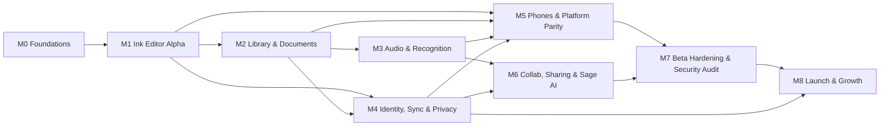

# Sane Notes — roadmap (M0–M8)

> Audience: an autonomous coding agent or engineer planning what to build next. This is the
> milestone-by-milestone plan: **scope, the PRD requirement IDs and ADRs each milestone delivers,
> exit criteria (functional + performance + security gates), and sequencing/dependencies.**
>
> **Milestone authority.** The binding milestone list is [`../issues/milestones.json`](../issues/milestones.json)
> and the assignment of an issue to a milestone is its `milestone` field in `issues/*.json`. ⚠️ The
> per-requirement `M#` tags *inside* PRD-01, PRD-02 and the innovation brief use an **older,
> editor-centric numbering** that does **not** map 1:1 to these authoritative milestones (this is
> recorded in [`QUALITY-REPORT.md`](QUALITY-REPORT.md)). Where they conflict, this roadmap and
> `milestones.json` win. Concrete remap: **audio→M3, recognition/OCR/math→M3, PDF+library→M2,
> identity/sync/E2EE→M4, phones+stylus-mastery→M5, collaboration+Sage-assistant→M6, website→M8.**
> Standing constraints (perf budgets, zero-knowledge, MASVS/ASVS, a11y, i18n) apply to **every**
> milestone, not just M7.

---

## Milestone summary

| # | Milestone | Theme | Primary PRDs | Lead ADRs |
|---|---|---|---|---|
| **M0** | Foundations | Repo, CI/DevSecOps, tokens, core model, ADRs, threat model, the ink risk-spike | PRD-ED (spike) | 0001–0005, 0008 |
| **M1** | Ink Editor Alpha | Lag-proof pen editor + brushes + pages + undo + local persistence on iPad/Android tablet/Web | PRD-01, PRD-03 `STOR` | 0008, 0009, 0003 |
| **M2** | Library & Documents | Notebook library, subjects/folders/tags/trash, templates, PDF, images, typed text, basic search | PRD-02, PRD-01 (text/shapes) | 0014, 0005 |
| **M3** | Audio & Recognition | Audio synced to ink, on-device transcription, handwriting/OCR/math/shape recognition + search | PRD-02 (audio/recog/search), PRD-01 (refine) | 0015, 0016 |
| **M4** | Identity, Sync & Privacy | Sign-in + guest, profiles, E2EE keys, sync via user's cloud, backup/restore, privacy, locks | PRD-03 | 0004, 0006, 0007, 0011 |
| **M5** | Phones & Platform Parity | iPhone + Android phone, stylus mastery, compatibility matrix, low-end hardening, foldables | PRD-01 (stylus), PRD-04 (widgets) | 0012, 0010 |
| **M6** | Collaboration, Sharing & Sage AI | Sharing/export, real-time collab, classroom rooms, Sane Sage assistant, study tools, backlinks, import | PRD-04 | 0013, 0016 |
| **M7** | Beta Hardening & Security Audit | Pentest, MASVS/ASVS verification, a11y audit, perf soak, store-readiness, privacy labels | all (verification) | — |
| **M8** | Launch & Growth | Billing, student verification, marketing/docs site + "try on web", store launch, opt-in telemetry | PRD-03 `BILL`, PRD-04 (website) | 0011 |
| **Backlog** | — | Deferred/ecosystem items not scheduled for v1–v2 | — | — |

Standing quality gates every milestone must keep green (details in
[`security/ssdlc-process.md`](security/ssdlc-process.md), [`security/devsecops-pipeline.md`](security/devsecops-pipeline.md),
[`platform/performance-budgets.md`](platform/performance-budgets.md)): `dart format` + `dart analyze
--fatal-infos` + arch-lint; unit/widget/golden tests; Semgrep, mobsfscan, gitleaks/trufflehog,
OSV-Scanner, dependency-review; the three security gate rules (no secrets, no PII in logs, no boundary
violations); and — once the editor exists (M1+) — the decision-7 latency/fps budgets in `tools/perf_harness`.

---

## M0 — Foundations

**Goal:** stand up everything later work builds on, and de-risk the one decision that can invalidate
the whole stack (ink latency).

**Delivers**
- Monorepo scaffold ([ADR-0002](adr/0002-monorepo-layout.md)): `app/`, the 12 `sane_*` package
  skeletons, `plugins/` platform-interfaces, `tools/perf_harness` + `tools/device_lab`. Arch-lint
  (DAG + `package:flutter` ban + `print()` ban) wired into CI.
- CI/DevSecOps pipeline live ([`security/devsecops-pipeline.md`](security/devsecops-pipeline.md)):
  `.github/workflows/devsecops.yml` (SAST/SCA/secret-scan/IaC/actions-lint/issues-schema) + Scorecard;
  CODEOWNERS, dependabot, PR/issue templates (already present).
- Design tokens usable from code ([`design/tokens.json`](design/tokens.json) → a `sane_ui` token
  layer, 17 looks + light/dark).
- **Core document model** in `sane_core`: Workspace→Profiles→Notebooks→Pages→Layers→Objects, the CRDT
  primitives (add-wins id set, LWW registers, HLC), `Result<T,Failure>`, repository interfaces
  ([ADR-0005](adr/0005-document-model-and-crdt.md), [`architecture/document-model.md`](architecture/document-model.md)).
  `sane_crypto` primitive selection stubbed ([ADR-0007](adr/0007-end-to-end-encryption-and-keys.md)).
- All 16 ADRs authored; [`security/threat-model.md`](security/threat-model.md) (STRIDE+LINDDUN) and
  [`security/controls-matrix.md`](security/controls-matrix.md) baselined.
- **p0 risk-spike `SN-INK`** ([ADR-0001](adr/0001-flutter-single-codebase.md)): measure pen-to-pixel
  latency of (a) pure-Flutter canvas and (b) Flutter + native wet-ink surface (Metal / Jetpack Ink),
  on the three reference devices. **This is the go/no-go for the Flutter editor surface.**
- PRD-01 M0 spike requirements (6).

**Exit criteria**
- [ ] `SN-INK` spike complete; ADR-0001 records the **per-platform tier decision and the exit
      criterion** (Tier A native vs Tier B pure-Flutter, or the documented pivot to native editor
      views with the Dart core kept). No later milestone proceeds on an unmeasured assumption.
- [ ] Monorepo builds; arch-lint enforces the package DAG; CI is green on an empty scaffold.
- [ ] `sane_core` model + CRDT unit-tested headlessly (no widget harness).
- [ ] Threat model + controls matrix reviewed by the Security Owner; DevSecOps pipeline runs on PRs.
- [ ] Perf harness can produce a pen-to-pixel latency number on at least one reference device.

**Depends on:** nothing. **Blocks:** everything.

---

## M1 — Ink Editor Alpha

**Goal:** a genuinely lag-proof pen-first editor on iPad, Android tablet and Web, with local
persistence — the product's beating heart.

**Delivers**
- Ink engine `sane_ink` + render `sane_render` + the native `sane_ink_surface` fast path
  ([ADR-0008](adr/0008-ink-pipeline-and-low-latency-surfaces.md),
  [`architecture/ink-engine.md`](architecture/ink-engine.md)): raw `Listener` capture, smoothing/
  streamline/prediction, palm rejection, active-stroke `CustomPainter` in a `RepaintBoundary`,
  cached-`Picture` flattening of finished strokes, two-tier selection by capability query.
- Brush engine `sane_brushes` ([ADR-0009](adr/0009-brush-engine.md)): the core pen/highlighter/
  eraser kit and the default brushes; pressure/tilt dynamics.
- Editor MVP + palette dock + paged pages + undo/redo (op-log-backed): PRD-01 editor-MVP + core
  pen-kit requirements (`PRD-ED-*`; the PRD's own "M1/M2" editor tags map here).
- Local persistence foundation: drift/SQLite schema + content-addressed blob store + `.sanenote`
  bundle v1 ([`architecture/file-format.md`](architecture/file-format.md)); the relevant PRD-03
  `PRD-STOR-*` rows; the storage isolate.
- App shell + adaptive layout + theming across the 17 looks ([ADR-0003](adr/0003-state-management-and-app-structure.md)).

**Exit criteria**
- [ ] **Perf gate (hard):** pen-down→pixel ≤ 16 ms on a ProMotion iPad, ≤ 25 ms on mid-range Android,
      ≤ 30 ms on Chrome desktop web; ≥ 60 fps and no frame > 16.7 ms while writing; enforced by
      `tools/perf_harness` in CI on reference devices. **A regression does not merge.**
- [ ] Write → close → reopen preserves strokes byte-for-byte; undo survives per the resolved undo-depth
      decision (≥ 60 user-visible steps).
- [ ] Golden tests cover ink/brush rendering across looks + light/dark.
- [ ] Editor works with no account (guest) and no network; nothing is logged from the draw loop in
      profile/release; no note content leaves the device.

**Depends on:** M0. **Blocks:** M2, M3 (they add objects/tools to this editor).

---

## M2 — Library & Documents

**Goal:** turn the single-canvas editor into a real notebook app: organise, template, import PDFs,
add images and typed text, and find things.

**Delivers**
- Library home & organisation: subjects, folders, tags, favourites, covers, recents, **trash with
  30-day purge**, notebook lifecycle (rename/duplicate/move/export via the `⋯` menu) — PRD-02
  `PRD-LB-039/060/065/…`; multi-profile data isolation (`PRD-LB-350`, `PRD-PROF-004`).
- Templates & paper (paged / infinite canvas / PDF-backed page kinds); freeform navigation
  (`PRD-LB-091`); page operations (`PRD-LB-142`).
- **PDF** import/render/annotate/export via `sane_pdf` ([ADR-0014](adr/0014-pdf-engine.md)); the
  `sane_pdfkit` acceleration plugin where beneficial.
- Images & media (`PRD-LB-180`: photos/camera/scan/stickers/GIF, EXIF-strip).
- Typed text tool + rich text + markdown-on-type + quote/callout/code blocks + tables
  (`PRD-ED-179…183`, `PRD-ED-185` group).
- Shapes & rulers with recognition (`PRD-ED` shape set, `PRD-LB-308`).
- Basic search (FTS5 over typed text/titles/tags) in `sane_search`.

**Exit criteria**
- [ ] Open a 1,000-page notebook < 1 s; scroll a 600-page PDF at 60 fps (perf gate).
- [ ] Import a hostile/malformed PDF/image fails **closed** into a user-safe error, parsed **off the UI
      isolate**, resource-capped (no zip/decompression bomb), path-confined — the input-validation
      checklist ([`security/secure-coding-checklist.md`](security/secure-coding-checklist.md) §1) is met;
      parser fuzzing is clean.
- [ ] Switching profiles swaps the entire visible dataset (notebooks/look/prefs), not just the avatar.
- [ ] Trash soft-delete + restore + 30-day purge works and is undoable.
- [ ] **Decision gate (maintainer):** DIY PDF annotation vs a commercial SDK (Nutrient/Apryse) — resolve
      at end of M2 (CLAUDE.md §13).

**Depends on:** M1. **Blocks:** M3 (audio/recognition attach to library items + PDFs), M6 (export/import).

---

## M3 — Audio & Recognition

**Goal:** lectures and legibility — record audio pinned to your ink, and make handwriting searchable
and convertible, all on-device.

**Delivers**
- Audio `sane_audio` ([ADR-0015](adr/0015-audio-pipeline.md)): multi-clip recording, background
  recording, playback, **time anchors linking audio ↔ ink/text**, waveform, multi-page span
  (`PRD-LB-212/220`); free-plan 30-minute cap behaviour (`PRD-LB-225`).
- On-device recognition & AI adapters `sane_ml` + `sane_ml_native`
  ([ADR-0016](adr/0016-on-device-ml-and-ai.md)): handwriting recognition, OCR, math recognition,
  transcription (Apple Speech / ML Kit / Whisper), shape beautification (`PRD-LB-303/307/308`);
  convert-to-text with confidence + correction UX; custom recognition dictionary (`PRD-LB-386`).
- Handwriting/ink search index + deep-linking search results to on-page quads/stroke ids
  (`PRD-LB-261`) in `sane_search`.
- Editor: handwriting refine/reflow (`PRD-ED-187`), code block (`PRD-ED-181`).

**Exit criteria**
- [ ] Transcription and recognition run **on-device** on a supported device (airplane-mode works);
      any cloud escalation is per-request opt-in with the "data leaves device" banner.
- [ ] Audio recording never blocks the UI isolate; a recording survives app background/interruption.
- [ ] Search returns handwriting matches and scrolls/highlights the exact on-page location.
- [ ] Recognition language is selectable per notebook and covers the broadest available set on **every**
      platform (no iOS-vs-Android disparity shipped).
- [ ] **Decision gate (maintainer):** MyScript vs ML-Kit-only for recognition — resolve before M4
      hardening (CLAUDE.md §13).

**Depends on:** M1 (ink), M2 (library items, PDF to OCR). **Blocks:** M6 (Sage assistant builds on recognition).

---

## M4 — Identity, Sync & Privacy

**Goal:** optional accounts and true zero-knowledge sync through the user's own cloud, with the full
privacy/security posture — without ever compromising guest-first note-taking.

**Delivers**
- Identity: Sign in with Google / Microsoft / Apple + phone-number OTP; **guest mode first-class**;
  the dev **auth bypass** guarded impossible-in-release (three layers + `auth_bypass_test.dart`) —
  PRD-03 `AUTH`, `PROF` ([ADR-0004](adr/0004-local-first-zero-server.md)).
- E2EE keys `sane_crypto` + `sane_secure_store` ([ADR-0007](adr/0007-end-to-end-encryption-and-keys.md),
  [`architecture/crypto.md`](architecture/crypto.md)): envelope encryption, key hierarchy, hardware
  key storage (Keychain/SE, Keystore/StrongBox), passkey-PRF / passphrase (Argon2id) ladder, printable
  recovery code — PRD-03 `KEY`.
- Sync `sane_sync` over the user's cloud drive ([ADR-0006](adr/0006-sync-over-user-cloud-drives.md),
  [`architecture/sync.md`](architecture/sync.md)): append-only op-log segments + snapshots +
  content-addressed encrypted blobs; CRDT merge; conflict handling; `sane_cloud_drive` (iCloud Drive /
  Google Drive) — PRD-03 `SYNC`.
- Backup/restore archive (`BKP`, `STOR`), privacy dashboard (`PRIV`), app/notebook/folder lock
  (`LOCK` incl. `PRD-LOCK-005/006`), clipboard/screenshot protection (`LEAK`), account deletion
  (`DEL`), the full settings inventory (`SET`), local notifications (`NOTIF`), opt-in telemetry
  (`TEL`, [ADR-0011](adr/0011-telemetry-and-diagnostics.md)).

**Exit criteria**
- [ ] Everything written to the cloud is **ciphertext only**; AEAD tag verified before use, fail-closed;
      a server/cloud compromise yields no plaintext; an account takeover yields no note plaintext.
- [ ] Auth bypass proven unreachable in a release-mode build by CI (`auth_bypass_test.dart`); OIDC uses
      PKCE + `state` + `nonce`, tokens in `sane_secure_store`.
- [ ] Two devices editing offline then syncing converge with no data loss (CRDT); large attachments
      chunk-encrypt without loading whole files into memory.
- [ ] Keys never hit disk/logs/backups; recovery code restores access; no vendor recovery path exists.
- [ ] MASVS-AUTH / MASVS-STORAGE / MASVS-CRYPTO / MASVS-NETWORK controls verified in the controls matrix;
      TLS 1.2+ + cert pinning for our own endpoints; no cleartext traffic.
- [ ] **Decisions (maintainer):** storage-cap model; web-PWA at-rest posture; guest→account key
      migration friction; per-profile vs per-account entitlement (CLAUDE.md §13).

**Depends on:** M0 (crypto/model), M1 (op-log persistence), M2 (content to sync). **Blocks:** M6
(collaboration + sharing need identity/keys/relay), M8 (billing needs identity).

---

## M5 — Phones & Platform Parity

**Goal:** first-class iPhone and Android phone experiences, stylus mastery, and hardening across the
full device matrix — parity that competitors fail at.

**Delivers**
- Phone-adaptive layouts (compact editor, one-hand reach, foldable window classes) for iPhone and
  Android phone; the compatibility matrix realised ([`platform/phones.md`](platform/phones.md),
  [`platform/compatibility-matrix.md`](platform/compatibility-matrix.md)).
- Stylus mastery via `sane_stylus` ([ADR-0012](adr/0012-native-plugin-strategy.md)): Apple Pencil Pro
  (squeeze / barrel-roll / hover / haptics), S Pen, USI, coalesced-sample capture — the PRD-01
  stylus-mastery requirements.
- Widgets / shortcuts / share-target (PRD-04 M5 area).
- Low-end performance hardening (4 GB Android / Snapdragon 680-class); web strategy consolidation
  ([ADR-0010](adr/0010-web-pwa-strategy.md)); memory/battery tuning.

**Exit criteria**
- [ ] All decision-7 budgets met on the **low-end reference device** (memory < 300 MB on 4 GB Android;
      cold start < 2 s mid-Android; 2-hour writing ≤ 12 % battery on iPad Pro); web cold start < 3 s
      cached.
- [ ] The editor is usable and lag-proof on a phone-sized screen with a finger and with a stylus.
- [ ] Foldable fold/unfold and window-class changes reflow without state loss.
- [ ] Stylus extras degrade gracefully where a device lacks them (capability query, not platform check).

**Depends on:** M1–M4. **Blocks:** M7 (soak/compat audit).

---

## M6 — Collaboration, Sharing & Sane Sage AI

**Goal:** share, co-edit, and study — plus the on-device assistant that makes the notes work for you.

**Delivers**
- Sharing & export: PDF/PNG/SVG/Markdown/JSON + `.sanenote`; share links + roles; competitor import
  (`.goodnotes`/`.note`/`.one`, legality-gated) — PRD-04 `PRD-CO-0xx`.
- Real-time collaboration ([ADR-0013](adr/0013-collaboration-transport.md)): WebRTC data channels +
  the optional **ciphertext-only** relay in `services/relay/`; classroom rooms; follow-a-collaborator
  (`PRD-CO-107`); seen/unseen activity (`PRD-CO-115`).
- Sane Sage assistant ([ADR-0016](adr/0016-on-device-ml-and-ai.md)): summaries, Q&A over notes,
  flashcards, action-item extraction (`PRD-CO-160`) — on-device by default, with prompt-injection
  defences and no autonomous exfil (`PRD-CO-167/171/172`).
- Study tools: flashcards + spaced repetition + study-set import (`PRD-CO-208`); backlinks & graph.

**Exit criteria**
- [ ] The relay only ever forwards **ciphertext**; a relay compromise leaks no plaintext; removing a
      collaborator rotates keys and denies their next sync.
- [ ] Cloud AI stays off unless a per-request opt-in with the data-leaves-device banner is taken;
      the assistant runs on-device on supported hardware; no note content is used for training.
- [ ] Share links land in a view/confirm context (never auto-mutate); share-key stays in the URL
      fragment; default share posture follows the resolved maintainer decision (build-time flag).
- [ ] Prompt-injection abuse cases pass; import of a hostile competitor file fails closed.
- [ ] **Decisions (maintainer):** relay/TURN hosting; cloud-AI provider policy; import legality;
      graph/tags scope (CLAUDE.md §13).

**Depends on:** M3 (recognition/AI base), M4 (identity/keys/relay). **Blocks:** M8 (launch surface).

---

## M7 — Beta Hardening & Security Audit

**Goal:** prove the guarantees before real users arrive.

**Delivers / activities** (verification-stage work — [`security/ssdlc-process.md`](security/ssdlc-process.md) §2.4)
- Manual/assisted **penetration test** exercising the abuse cases (deep-link forgery, intent
  redirection, E2EE-bypass attempts, share-link leakage, WebView XSS).
- **MASVS 2.x L2 + ASVS 5.0 L2 verification** against the controls matrix; **MobSF** on release-
  candidate APK/AAB/IPA; **ZAP** full active scan on staging web + relay; parser fuzzing.
- **Accessibility audit** (WCAG 2.2 AA; VoiceOver/TalkBack; OCR alt-text) and **i18n/RTL** audit.
- **Performance soak** across the device lab; store-readiness (privacy labels + privacy manifest +
  Play Data Safety reflecting the zero-knowledge reality).

**Exit criteria**
- [ ] Pentest P0/P1 findings fixed or explicitly risk-accepted by the Security Owner; each fixed vuln
      has a regression test.
- [ ] No unresolved high MASVS/Mobile-Top-10 (MobSF) or high/medium web (ZAP) findings; fuzzing clean.
- [ ] WCAG 2.2 AA met on all chrome; every supported locale (incl. Arabic RTL) renders correctly.
- [ ] All decision-7 budgets hold under soak on every reference device.
- [ ] Store privacy declarations accurate and signed off.

**Depends on:** M1–M6. **Blocks:** M8.

---

## M8 — Launch & Growth

**Goal:** ship it, and let people pay for Pro.

**Delivers**
- Billing & entitlements `sane_billing` + `services/entitlements/`: plans, IAP / web checkout, the
  **Free vs Pro** gating (₹83/month reference), entitlement tokens verified against a pinned key,
  **fail-open to the free tier** — PRD-03 `BILL`.
- Student verification (time-boxed, annually re-verified) — PRD-03 `BILL`.
- Marketing + docs website and **"try on web"** (PRD-04 website area, M8).
- Store launch; **opt-in** telemetry ([ADR-0011](adr/0011-telemetry-and-diagnostics.md)); support & docs.
- Release engineering: signing (Play App Signing / App Store), notarization, **SBOM (CycloneDX+SPDX)**,
  **SLSA provenance (target L3)**, staged rollout ([`security/devsecops-pipeline.md`](security/devsecops-pipeline.md)).

**Exit criteria**
- [ ] Release artifacts signed + notarized; SBOMs + provenance attached; **SLSA L3** target met for
      release artifacts.
- [ ] Entitlement failure never punishes the user (degrades to free, never blocks local note-taking).
- [ ] Original **Sage mascot art** shipped (watermarked placeholders removed — a hard release blocker).
- [ ] License chosen and a `LICENSE` file present.
- [ ] Store privacy labels accurate; telemetry defaults off; support + docs live.
- [ ] **Credentials in place (maintainer):** production OAuth client IDs/secrets, store accounts, signing
      keys — via CI secrets, never committed (issues marked `needs-credentials`).

**Depends on:** M4 (identity), M6 (feature surface), M7 (hardening).

---

## Backlog (not scheduled for v1–v2)

Deferred per the competitor matrix "later" bucket and locked scope (CLAUDE.md §13,
[`product/prd-00-index.md`](product/prd-00-index.md) §4): native macOS/Windows clients; a
marketplace/pen-pack economy beyond `.sanepen` sharing; Goodnotes-style external-LLM connectors;
AI diagram/mind-map generation (`PRD-CO-162`) and equation graphing (`PRD-CO-163`); `.docx`/`.pptx`
export (`PRD-CO-041`); public web-publish of a note (`PRD-CO-040`, MAY/M8); email-to-import
(`PRD-LB-391`) and web clipper (`PRD-LB-390`) — the only additions needing infrastructure beyond the
zero-server model, both marked MAY/verify.

---

## Sequencing & dependencies at a glance

**Notes on the critical path.** M0→M1 is strictly serial and highest-risk (the `SN-INK` spike can
force a native-editor pivot before M1 begins). M4 (identity/sync/E2EE) can proceed **in parallel** with
M3 once M2 exists, since it depends on the persistence/op-log foundation (M1) and content (M2), not on
audio/recognition. M5 is largely hardening/adaptation over M1–M4 and can overlap M6. M6 is the only
milestone needing both the AI base (M3) and the identity/keys/relay (M4). M7 gates M8. Within a
milestone, always build in the package DAG order (model → logic → native → render → state → UI →
persist/sync → search/AI), and never pick up an issue whose `depends_on` has not landed.
