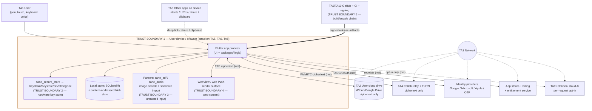
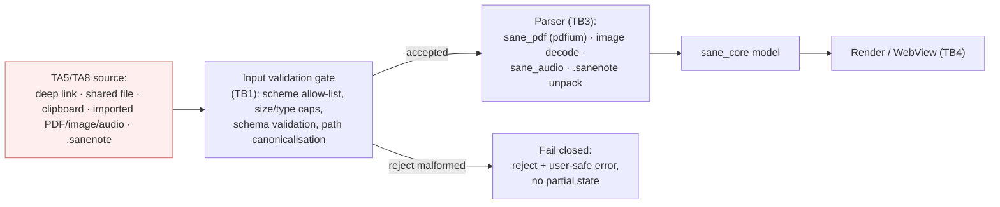

# Sane Notes — Threat Model (STRIDE + LINDDUN)

> Audience: an autonomous coding agent (or engineer) with **zero prior context** who must
> extend Sane Notes without breaking its security or privacy guarantees. Read this before you
> touch `sane_crypto`, `sane_sync`, `sane_secure_store`, `sane_cloud_drive`, the relay, the
> auth flow, or any parser (PDF/image/audio). It is the source of the "Security & privacy"
> section every issue must fill (see [`../../issues/SCHEMA.md`](../../issues/SCHEMA.md)) and of
> the PR checklist in [`../../.github/PULL_REQUEST_TEMPLATE.md`](../../.github/PULL_REQUEST_TEMPLATE.md).
>
> **Status:** living document, v1 (M0 Foundations). Update it **in the same PR** whenever you
> add or change a trust boundary, a data flow, an external dependency, or a stored asset. A
> boundary change with no threat-model update is a review blocker.
>
> Companion docs: [`secure-coding-checklist.md`](secure-coding-checklist.md) (per-PR review),
> [`controls-matrix.md`](controls-matrix.md) (MASVS/ASVS/SSDF mapping),
> [`ssdlc-process.md`](ssdlc-process.md) (process gates),
> [`devsecops-pipeline.md`](devsecops-pipeline.md) (CI enforcement),
> [`../../SECURITY.md`](../../SECURITY.md) (disclosure). Architecture:
> [`../architecture/overview.md`](../architecture/overview.md). Research basis:
> `research/security-standards-and-devsecops.md`, `research/local-first-sync-and-crdt.md`,
> `research/web-stylus-and-pwa-capabilities.md`.

---

## 0. Method

We combine two complementary frameworks over the same data-flow diagrams
(`research/security-standards-and-devsecops.md` §4):

- **STRIDE** (Microsoft) for **security** threats: **S**poofing, **T**ampering,
  **R**epudiation, **I**nformation disclosure, **D**enial of service, **E**levation of
  privilege.
- **LINDDUN** (KU Leuven) for **privacy** threats: **L**inkability, **I**dentifiability,
  **N**on-repudiation, **D**etectability, **D**isclosure of information, **U**nawareness,
  **N**on-compliance.

For a note app the payload is *entirely* user-authored personal content, so STRIDE-I
(disclosure) and every LINDDUN category are first-class, not afterthoughts. The design answer
across the board is **local-first + zero-knowledge E2EE + metadata minimisation** (locked
decisions 3, 8; `research/local-first-sync-and-crdt.md` §6, "Threats & mitigations").

### 0.1 Scoring scale

| Dimension | Values | Meaning |
|---|---|---|
| **Likelihood** | Low / Med / High | Probability a capable attacker exploits it in the design as specified, over the product lifetime. |
| **Impact** | Low / Med / High / **Critical** | Worst-case harm. **Critical** = mass disclosure of plaintext notes, key compromise, or silent code execution. |
| **Risk** | derived | High×Critical and High×High are P0; treat Med×Critical as P0 too (one incident is unacceptable). |

### 0.2 Status legend

| Status | Meaning |
|---|---|
| **Designed** | Mitigation is specified in an ADR/PRD/this doc; not yet built. |
| **Planned** | Scheduled in a milestone with an issue key. |
| **Partial** | Some layers implemented; residual gap tracked. |
| **Implemented** | Built and covered by an automated test or CI gate. |
| **Accepted** | Residual risk consciously accepted; rationale recorded. |

At M0 almost everything is **Designed**; the value of this doc is that the mitigation and its
**verification** are fixed *now*, so implementation issues inherit them.

---

## 1. Assets (what we protect, ranked)

| # | Asset | Where it lives | Sensitivity | If lost/leaked |
|---|---|---|---|---|
| A1 | **Note plaintext** — ink strokes, typed text, images, PDFs, audio | Device (SQLite/drift + blob store); RAM while open | **Critical** | Total privacy failure; the product promise is broken. |
| A2 | **User master key** + wrapped per-notebook/per-item keys | Keychain / Keystore / Secure Enclave / StrongBox; RAM while unlocked | **Critical** | Attacker decrypts all cloud + local ciphertext. |
| A3 | **Recovery code** (escrow wrap of master key) | User-held, offline (printed/saved); never on our servers | **Critical** | Whoever holds it can decrypt everything; loss = permanent data loss (no vendor reset). |
| A4 | **Sync ciphertext** (op-log segments, snapshots, blobs) | User's own iCloud Drive / Google Drive | High (confidentiality via A2) | Confidentiality holds *iff* A2 holds; integrity via AEAD tags. |
| A5 | **Sync/CRDT metadata** — notebook/page ids, HLC vectors, device ids, timestamps, sizes, filenames | Manifest (encrypted) + drive object names/sizes/mtimes (partly observable) | Med | Linkability/identifiability of activity even without plaintext. |
| A6 | **Identity tokens** — OIDC/OAuth access & refresh tokens, phone-OTP session | Secure storage; RAM | High | Account/sharing takeover; entitlement fraud. |
| A7 | **Collab session data** — WebRTC channel, room key, presence | RAM; relay sees ciphertext only | High | Live note disclosure if room key leaks. |
| A8 | **Entitlement state** — plan, receipts, student-verification proof | Device; entitlement service (stateless verify) | Med | Revenue loss; PII (student email) exposure. |
| A9 | **Build & signing integrity** — source, CI, signing keys, provenance | GitHub, CI, Play App Signing, Apple notarization | **Critical** | Supply-chain compromise ships malware to every user (2025 OWASP A03). |
| A10 | **Telemetry / diagnostics** (opt-in, sanitised) | In-memory ring buffer; opt-in crash report | Low–Med | Content leakage if redaction fails. |
| A11 | **Device-local availability** — the notebook itself, undamaged | Device + user cloud copies | High | Data loss = user trust loss even without disclosure. |

---

## 2. Actors / threat agents

| ID | Actor | Trusted? | Capability / motive |
|---|---|---|---|
| TA1 | **Legitimate user** | Trusted | Owns the device and keys. Can misconfigure (weak passphrase, lost recovery code). |
| TA2 | **Cloud storage provider** (Apple/Google) | **Untrusted for confidentiality** | Holds sync bytes; can read anything not encrypted; can observe object names/sizes/timestamps; can lose/corrupt data. |
| TA3 | **Network attacker** (Wi-Fi MITM, rogue AP, hostile ISP) | Untrusted | Intercept/modify traffic to identity providers, stores, relay, drive APIs, opt-in AI. |
| TA4 | **Malicious/compromised relay or signalling/TURN server** | Untrusted | Sees collab traffic; wants plaintext or to inject peers. |
| TA5 | **Malicious app on the same device** | Untrusted | Sends crafted intents/URLs/share payloads; probes exported components, clipboard, screenshots, backups. |
| TA6 | **Thief with the physical device** | Untrusted | Locked device; may attempt offline extraction, backup dumping, screen-record over shoulder. |
| TA7 | **Malicious sharer/collaborator** | Semi-trusted | A person the user shared a note with; wants to escalate to other notes, or keep access after revocation. |
| TA8 | **Malicious document author** | Untrusted | Crafts a PDF/image/audio/`.sanenote`/deep-link/OTA payload to exploit a parser or bridge. |
| TA9 | **Supply-chain attacker** | Untrusted | Compromises a dependency, a GitHub Action, or a CI secret to inject code. |
| TA10 | **Malicious insider / compromised maintainer account** | Semi-trusted | Pushes a backdoor; bypasses review. |
| TA11 | **Curious/adversarial AI provider** (optional cloud AI) | Untrusted | Receives content only on explicit per-request opt-in; may log/retain. |
| TA12 | **Regulator / legal process** | External | Can compel a party. Zero-knowledge design means we hold nothing to compel. |

---

## 3. Trust boundaries



**The five boundaries and the rule at each crossing:**

| # | Boundary | Rule at the crossing |
|---|---|---|
| **TB1** | Outside world ↔ app on device | Everything inbound is untrusted: validate all input (files, URLs, intents, clipboard, network). |
| **TB2** | App process ↔ hardware key store | Raw key material never crosses back into app-managed memory in a persistable form; keys are used inside the store or held transiently, gated by biometrics. |
| **TB3** | App ↔ parser of untrusted document | Parse defensively, bound resources, prefer memory-safe/sandboxed decoders; a malformed file must fail closed, never execute. |
| **TB4** | App ↔ web render surface (WebView/PWA) | No untrusted HTML reaches a DOM sink without sanitisation; strict CSP + Trusted Types; no unrestricted JS bridge. |
| **TB5** | Source ↔ shipped binary (CI/supply chain) | Every artifact is built from reviewed source on a hosted runner, pinned deps, signed, with SLSA provenance. |

**The load-bearing invariant:** across TB1's network edges to TA2/TA4, **only ciphertext ever
leaves the device.** No Sane Notes server stores note content (locked decision 3). If A2 (the
master key) holds, a full breach of the cloud provider or relay yields nothing readable.

---

## 4. Data-flow diagrams (security-annotated)

The canonical flows live in [`../architecture/overview.md`](../architecture/overview.md) §3.
Here are the two flows a threat modeller must reason about, annotated with the boundary each
step crosses and the STRIDE/LINDDUN threats it raises.

### 4.1 DFD-A — Local capture → persist → sync

```mermaid
sequenceDiagram
    autonumber
    participant U as TA1 User pen
    participant App as App (UI isolate)
    participant Core as sane_core (CRDT)
    participant DB as Storage isolate (drift+blobs)
    participant Cr as sane_crypto
    participant KS as sane_secure_store (TB2)
    participant Sync as Sync isolate
    participant Cloud as TA2 Cloud drive (TB1 net)

    U->>App: pen samples (plaintext, A1)
    App->>Core: commit Stroke (CRDT op, HLC)
    Core->>DB: append op + write blob (A1 at rest)
    Note over DB: THREAT: I/T — local disk read, backup dump (TA5/TA6)
    Core->>Sync: op-log segment ready
    Sync->>KS: unwrap per-notebook key (biometric-gated)
    Note over KS: THREAT: E/I — key extraction, unlocked-device abuse (TA6)
    KS-->>Sync: transient key handle
    Sync->>Cr: envelope-encrypt segment (XChaCha20/AES-GCM, A4)
    Cr-->>Sync: ciphertext + AEAD tag
    Sync->>Cloud: write ciphertext object
    Note over Cloud: THREAT: I/T/D — provider breach, tamper, quota DoS (TA2)<br/>THREAT: L/I/Det — object name/size/time metadata (A5)
    Cloud-->>Sync: remote segments (other devices)
    Sync->>Cr: verify tag + decrypt
    Note over Cr: THREAT: T — forged/rolled-back segment; fail closed (2025 A10)
    Sync->>Core: CRDT-merge applied ops
```

### 4.2 DFD-B — Inbound untrusted content (import / deep link / share / paste)



**Threats on DFD-B:** T/E via parser memory-corruption (TA8), S/E via intent redirection or
overbroad deep-link routing (TA5), I via a WebView that renders imported HTML into a live DOM
sink (TA8→XSS), D via a decompression/`.sanenote`-zip bomb (TA8). Mitigations are enumerated
in §5 and enforced by [`secure-coding-checklist.md`](secure-coding-checklist.md).

---

## 5. STRIDE threat register

IDs are stable: `TM-<STRIDE letter>-NN`. "Verification" names the concrete test/gate that
proves the mitigation (MASTG test id, CI job, or unit/integration test) — this is what an
implementing issue must satisfy in its Test plan.

### 5.1 Spoofing (S)

| ID | Component | Threat | Likelihood | Impact | Mitigation | Verification | Status |
|---|---|---|---|---|---|---|---|
| TM-S-01 | Identity / sign-in | Attacker impersonates a user via stolen or replayed OIDC token (TA3) | Med | High | OIDC/PKCE, nonce + state, short-lived access tokens, refresh rotation; tokens in `sane_secure_store` not shared prefs; TLS-only (MASVS-AUTH-1/3, ASVS V6/V9) | MASTG-TEST auth flow review; unit test rejecting missing/replayed nonce; TLS pinning test | Designed |
| TM-S-02 | Phone-OTP | OTP brute force / SIM-swap to seize account (TA3/TA7) | Med | High | Rate-limit + lockout at provider; OTP is *identity only*, never gates note access (guest mode is first-class); no note data recoverable via account (zero-knowledge) | Integration test: account takeover yields **no** plaintext (keys not derivable from identity) | Designed |
| TM-S-03 | Collab peer join | Malicious peer joins a share room and reads live edits (TA4/TA7) | Med | High | Peer authentication by public key (Ed25519); room key delivered only via URL **fragment** (never to a server); revocation rotates the content key (`research/local-first-sync-and-crdt.md` §7) | Test: rotated key excludes revoked member; relay-only sees ciphertext | Designed |
| TM-S-04 | Deep link / Universal Link / App Link | Another app forges a link to trigger a sensitive action or open a note (TA5) | Med | Med | Verified App Links (`autoVerify` + `assetlinks.json`) / Universal Links (AASA), no custom-scheme fallback for sensitive routes; links open **view** context only, never auto-import or auto-share without confirmation | MASTG-TEST-0028 (deeplink) equiv.; test that a forged link cannot mutate state | Designed |
| TM-S-05 | Entitlement service | Spoofed "Pro" entitlement token grants paid features (TA1 abuse) | Low | Med | Server-signed entitlement token verified with pinned public key; receipts validated server-side; graceful, non-punitive failure | Unit test rejecting unsigned/expired token | Designed |

### 5.2 Tampering (T)

| ID | Component | Threat | Likelihood | Impact | Mitigation | Verification | Status |
|---|---|---|---|---|---|---|---|
| TM-T-01 | Sync ciphertext in cloud | Provider or attacker corrupts/alters a segment (TA2/TA3) | Med | High | AEAD (XChaCha20-Poly1305 / AES-256-GCM) auth tag on every object; reject on tag mismatch (fail closed); manifest hash rejects truncated/partial files | Unit test: flipped byte → decrypt refused, no partial apply | Designed |
| TM-T-02 | Sync op-log | Replay/rollback of an old segment to revert edits (TA2) | Med | Med | HLC-stamped ops + monotonic per-device sequence; snapshot manifest records highest applied seq; out-of-order/rolled-back segments detected and ignored | Test: replayed old segment does not regress state | Designed |
| TM-T-03 | Local database / blobs | Malicious app or attacker with FS access edits the drift DB or blobs (TA5/TA6) | Low | High | OS sandbox (per-app storage); blobs content-addressed (hash mismatch = reject); sensitive DB fields encrypted; iOS Data Protection / Android FBE at rest (MASVS-STORAGE-1) | MASTG-TEST-0200/0201 storage review; hash-verify test | Designed |
| TM-T-04 | App binary / OTA | Tampered binary or malicious dynamic code load (TA8/TA9) | Low | Critical | No dynamic code loading / no OTA JS/Dart bundle execution (MASVS-CODE-4); Play App Signing + Apple notarization; optional integrity/attestation on paid/E2EE tiers (MASVS-RESILIENCE-2/4) | Semgrep rule banning dynamic eval; store signing enforced in `release.yml` | Designed |
| TM-T-05 | Build pipeline | Dependency/action swap injects code (TA9) | Med | Critical | Pinned actions (SHA), `dependency-review`, OSV-Scanner, SBOM, SLSA provenance, `contents: read` default token (`../../.github/workflows/devsecops.yml`) | CI green gate; Scorecard Pinned-Dependencies check | Partial |
| TM-T-06 | `.sanenote` / imported file | Crafted bundle mutates unrelated notes or paths on import (TA8) | Med | Med | Schema-validate manifest; canonicalise + confine all paths (no `..`/absolute); import into an isolated new notebook by default; never overwrite by path from file content | Fuzz + unit test: path-traversal payload confined | Designed |

### 5.3 Repudiation (R)

| ID | Component | Threat | Likelihood | Impact | Mitigation | Verification | Status |
|---|---|---|---|---|---|---|---|
| TM-R-01 | Collab edits | A collaborator denies making an edit (TA7) | Low | Low | Ops carry `deviceId` in the HLC; collab ops signed by peer key where collaboration is enabled; local, user-owned history (not a legal audit log — privacy-preserving by design) | Test: op attribution stable across merge | Designed |
| TM-R-02 | Relay / service logs | Absent logs prevent incident reconstruction (operability) | Low | Med | Relay/entitlement services log **connection metadata only, never content**, with retention limits; structured audit events (ASVS V16) | Service log-field allow-list test; no-content assertion | Designed |
| TM-R-03 | Client diagnostics | User cannot prove/deny what left the device | Low | Low | Every network egress is user-visible; opt-in telemetry only; "data leaves device" banner for cloud AI (locked decisions 6, 8) | UI test: banner shown before any cloud AI call | Designed |

### 5.4 Information disclosure (I) — the highest-priority family

| ID | Component | Threat | Likelihood | Impact | Mitigation | Verification | Status |
|---|---|---|---|---|---|---|---|
| TM-I-01 | Cloud drive | Provider breach reads notes (TA2) | Med | **Critical** | **Client-side E2EE of every byte** before it hits the drive (XChaCha20-Poly1305 + envelope keys); provider stores only ciphertext (`research/local-first-sync-and-crdt.md` §6) | Integration test: bytes on drive are indistinguishable from random; no plaintext markers | Designed |
| TM-I-02 | Master key | Weak passphrase brute-forced from stolen ciphertext (TA2/TA6) | Med | **Critical** | Argon2id (64 MiB, 5 iters) + per-user random salt from stored seed; prefer **passkey-PRF** (hardware secret, no guessable password) or platform-keychain-wrapped keys | KDF-params test; MASTG-TEST crypto-KDF review | Designed |
| TM-I-03 | Key at rest | Master key extracted from device storage (TA6) | Low | **Critical** | Keys in Keychain/Keystore/SE/StrongBox, non-exportable, biometric-gated (`setUserAuthenticationRequired`); never persist decrypted master key to disk; wipe from RAM on lock (MASVS-STORAGE-2/CRYPTO-2) | MASTG-TEST-0208/keystore review; memory-scrub test | Designed |
| TM-I-04 | Sync metadata | Titles/paths/sizes/timestamps leak activity even without plaintext (TA2) | Med | Med | Encrypt names (opaque ids; name→id map only inside encrypted payload); pad/round sizes; **avoid deterministic filename hashes** (confirmation attacks); document what metadata is intentionally cleartext | Test: object names carry no plaintext; size-padding applied | Designed |
| TM-I-05 | Logs / diagnostics | Note content, keys, tokens, PII written to logs (TA5/TA10) | Med | High | `SaneLog` facade with field allow-list; **`print()` banned** (lint + arch-check); never log content/coords/keys/tokens/paths/email/phone; redacted diagnostics bundle (overview §8.2, locked decision 8) | Grep/CI gate for `print(`; log-redaction unit test | Partial |
| TM-I-06 | WebView / PWA | XSS in rendered note HTML/markdown discloses other notes or tokens (TA8) | Med | High | Strict nonce-based CSP; **Trusted Types** + DOMPurify on every DOM sink; no untrusted HTML to `innerHTML`; secure WebView config, no file/JS-bridge exposure (MASVS-PLATFORM-2, ASVS V1/V3; `research/web-stylus-and-pwa-capabilities.md` §10) | ZAP baseline; CSP header test; Trusted-Types violation test | Designed |
| TM-I-07 | Screenshots / clipboard / notifications | Secure-note content leaks via OS surfaces (TA5/TA6) | Med | Med | Flag-secure/`isSecureTextEntry` for locked notes; excerpt-free notifications; clipboard-clear timers; screenshot-block toggle (MASVS-PLATFORM-3; PRD-03 `LEAK` reqs) | MASTG-TEST screenshot/clipboard checks; UI test | Designed |
| TM-I-08 | Optional cloud AI | Content sent to a cloud model is logged/retained by provider (TA11) | Med | High | On-device by default; cloud inference is **explicit per-request opt-in** with a visible banner; send the minimum span; no silent background calls (locked decision 6) | UI test: no cloud call without opt-in; network-log review | Designed |
| TM-I-09 | Share link | Wrapped key in URL leaks via referrer/history/logs (TA3/TA5) | Med | High | Key in URL **fragment** (`#…`, never sent to server); warn on link handling; short-lived/rotatable content key (`research/local-first-sync-and-crdt.md` §7) | Test: fragment never appears in any request; referrer stripped | Designed |
| TM-I-10 | Backups | iCloud/Android auto-backup exfiltrates keys/notes in the clear (TA6) | Low | High | Exclude key material from backups; encrypted DB; Android `allowBackup=false` for sensitive stores / `fullBackupContent` rules; iOS exclude-from-backup on caches (MASVS-STORAGE-1) | MASTG-TEST backup review; manifest/entitlement check | Designed |

### 5.5 Denial of service (D)

| ID | Component | Threat | Likelihood | Impact | Mitigation | Verification | Status |
|---|---|---|---|---|---|---|---|
| TM-D-01 | Parsers | Zip-bomb `.sanenote` / decompression bomb / malformed PDF exhausts memory or hangs (TA8) | Med | Med | Size/entry caps before decompress; streaming/bounded decode; time and memory budgets; parse off the UI isolate; fail closed | Fuzz corpus + resource-limit test; no UI-isolate block | Designed |
| TM-D-02 | Sync | Provider quota exhaustion / 429 throttle stalls sync (TA2) | Med | Low | Compact aggressively, dedup attachments, lazy-fetch, exponential backoff on 403/429, surface storage-full to user (`research/local-first-sync-and-crdt.md` "Threats") | Backoff unit test; storage-full UX test | Designed |
| TM-D-03 | Relay | Flood/abuse of the collab relay (TA4) | Low | Low | Rate-limit per room/IP; relay is optional and stateless; app degrades to file-based sync when relay is down (STRIDE-D, overview §1.1) | Load test; relay-down fallback test | Designed |
| TM-D-04 | CRDT history | Op-log/history blow-up slows open of large notebooks (TA1 scale) | Med | Med | Chunk per page; compact to snapshots; offload heavy strokes/attachments to content-addressed blobs; perf gate (decision 7: 1,000-page open < 1 s) | `tools/perf_harness` gate; large-notebook load test | Designed |

### 5.6 Elevation of privilege (E)

| ID | Component | Threat | Likelihood | Impact | Mitigation | Verification | Status |
|---|---|---|---|---|---|---|---|
| TM-E-01 | **Dev auth bypass** (`SANE_AUTH_BYPASS`) | Bypass flag ships in a release build, skipping sign-in (p0) | Low | **Critical** | Three independent layers: compile-time dead-code elimination behind `kReleaseMode`, runtime `assertAuthBypassSafe()` throw, and a CI test proving unreachability in release (overview §7.2, locked decision 5) | `app/test/security/auth_bypass_test.dart`; release-build reachability test in CI | Designed |
| TM-E-02 | Exported components / intents | Malicious app invokes an exported Activity/Service/Provider or hijacks an implicit intent (TA5) | Med | Med | Export nothing that need not be; `exported=false` by default; permission-guard IPC; validate all incoming intent extras; no PendingIntent mutability leaks (MASVS-PLATFORM-1) | MASTG-TEST exported-component review; mobsfscan gate | Designed |
| TM-E-03 | JS bridge / WebView | Injected JS reaches native via an over-broad bridge (TA8) | Low | High | No `@JavascriptInterface`/message handler exposed to untrusted content; if a bridge exists, allow-list methods + validate args; untrusted HTML never in an app-privileged WebView (MASVS-PLATFORM-2) | Bridge-surface review; ZAP + manual test | Designed |
| TM-E-04 | Parser RCE | Memory corruption in a native parser yields code execution (TA8) | Low | Critical | Prefer memory-safe/maintained decoders (pdfium pinned & patched); bound inputs; run parsing with least privilege; keep native deps current (MASVS-CODE-2/3) | Fuzzing of parsers (verification stage); OSV-Scanner on native deps | Planned |
| TM-E-05 | CI token / secrets | Over-privileged `GITHUB_TOKEN` or leaked CI secret enables repo/release tampering (TA9) | Med | Critical | `permissions: read` default, escalate per-job; OIDC for deploys (no static creds); branch protection + CODEOWNERS on `/.github/`, `sane_crypto`, `sane_sync`, auth (`../../.github/CODEOWNERS`) | Scorecard Token-Permissions; actionlint; CODEOWNERS review | Partial |

---

## 6. LINDDUN privacy threat register

IDs are stable: `TM-P-NN`. These target A1 (content) and A5 (metadata). The design answer is
E2EE + metadata minimisation + on-device processing + honest store labels (locked decisions
3, 6, 8; `research/security-standards-and-devsecops.md` §5).

| ID | LINDDUN cat. | Component | Threat | Likelihood | Impact | Mitigation | Verification | Status |
|---|---|---|---|---|---|---|---|---|
| TM-P-01 | **L**inkability | Sync metadata (A5) | Cloud provider links a user's devices/sessions by object names, sizes, timing (TA2) | Med | Med | Opaque object ids; size padding; batch/jitter writes; single-writer per-device segments carry no cross-user linkage | Metadata-review test; no deterministic filename hashes | Designed |
| TM-P-02 | **I**dentifiability | Relay / entitlement | IP + device id + timing identify a user behind pseudonymous data (TA4/TA2) | Med | Med | Minimise identifiers at relay; no account required to take notes; entitlement verify is stateless; retention limits | Service data-map review; no-PII-store test | Designed |
| TM-P-03 | **N**on-repudiation (privacy harm) | Client history / collab | User cannot plausibly deny an action because it is permanently attributable | Low | Low | Local, user-controllable history; no vendor-side immutable audit of personal actions; user can delete history | History-delete test | Designed |
| TM-P-04 | **D**etectability | Cloud / network | Observer detects *that* a user is active / has a note on a topic even without content (TA2/TA3) | Med | Low | Padding + batching hide sizes/counts; lazy sync; TLS hides paths; document residual (timing) as accepted | Traffic-shape review | Partial |
| TM-P-05 | **D**isclosure | All content stores (A1/A4) | Unauthorised access to personal note data | Med | **Critical** | Same E2EE + key-store + input-validation stack as STRIDE-I (TM-I-01..10) | See TM-I-01..10 verifications | Designed |
| TM-P-06 | **U**nawareness | UX / consent | User unaware what data is processed, where, or that AI/cloud is involved | Med | Med | In-context consent, "data leaves device" banner, privacy dashboard, Play Data Safety + Apple Privacy Labels/Manifest reflecting "minimal/no data collected" (PRD-03 `PRIV`; locked decision 8) | UI test: consent + banner; label accuracy review | Designed |
| TM-P-07 | **N**on-compliance | Whole product | Fails GDPR / India DPDP 2023 / COPPA obligations (TA12/regulatory) | Med | High | Data minimisation by design; consent (free/specific/informed/withdrawable); export + erasure + correction rights; COPPA/DPDP age gate; no behavioural ads/monitoring to minors; 72 h breach process | [`controls-matrix.md`](controls-matrix.md) privacy section; DPIA on major features | Designed |
| TM-P-08 | Linkability/Disclosure | Optional cloud AI (A1) | Content sent to AI provider is retained/linked to the user (TA11) | Med | High | On-device by default; explicit per-request opt-in; minimum-span send; no persistent identifiers to provider; prefer zero-retention endpoints | UI opt-in test; provider-contract review | Designed |
| TM-P-09 | Non-compliance / Disclosure | Student verification (A8) | Student email/ID over-collected or retained (TA1 PII) | Low | Med | Verify via third party where possible; store proof, not raw docs; short retention; purpose-limited (PRD-03 `BILL`) | Retention test; data-map review | Designed |

---

## 7. Residual risks & explicit assumptions

| # | Residual risk / assumption | Disposition |
|---|---|---|
| RR1 | **Lost passphrase + lost recovery code = permanent data loss.** True zero-knowledge has no vendor reset. | **Accepted & surfaced** in UX ("recovery code loss is fatal"); escrow via user-held code + platform keychain sync only (`research/local-first-sync-and-crdt.md`). |
| RR2 | **Compromised, unlocked device with the app open** exposes plaintext in RAM. | Partially mitigated (auto-lock, biometric re-gate, RAM scrub on lock); a fully compromised OS is out of scope (see [`../../SECURITY.md`](../../SECURITY.md)). |
| RR3 | **Traffic-timing detectability** (TM-P-04) is not fully eliminated by padding. | **Accepted**; documented; revisit if a stronger anonymity requirement appears. |
| RR4 | **Intentionally-cleartext metadata** (which exactly) must be decided and documented per PRD-03 §5/§6. | **Open** — record the final cleartext set in `sane_sync` docs before GA. |
| RR5 | **CloudKit JS / provider API longevity** for web-side user storage is uncertain (`research/web-stylus-and-pwa-capabilities.md` §8). | Treat as risk; keep `.sanenote` open-format export so data is never stranded. |
| RR6 | **iOS jailbreak / Android root** defeats hardware key gating for a determined local attacker. | Root/jailbreak detection + attestation on paid/E2EE tiers (MASVS-RESILIENCE); documented as best-effort, not absolute. |
| RR7 | **Supply-chain (TA9/TA10)** cannot be reduced to zero. | Pinned deps, review, SLSA L3 target, SBOM, Scorecard; accept residual and monitor. |

**Out of scope** (per [`../../SECURITY.md`](../../SECURITY.md)): third-party services (Apple
iCloud, Google Drive, Microsoft identity) internals, social engineering of the user, and
volumetric DoS against third-party infrastructure.

---

## 8. How to use and maintain this model

1. **Every new feature** fills the issue's "Security & privacy" section by citing the relevant
   `TM-*` IDs and the controls in [`controls-matrix.md`](controls-matrix.md).
2. **Any new trust-boundary crossing** (a new network call, a new parser, a new exported
   component, a new stored asset, a new third-party SDK) **requires a new/updated threat row
   in the same PR** — enforced by the PR checklist and CODEOWNERS on `/docs/security/`.
3. **Design reviews** (see [`ssdlc-process.md`](ssdlc-process.md)) walk this DFD for the
   feature under review and add rows before implementation starts.
4. **Re-run STRIDE + LINDDUN before each milestone** and whenever the architecture overview's
   data-flow section changes.

_Last STRIDE/LINDDUN pass: M0 Foundations. Next scheduled: start of M1 (Ink editor)._
